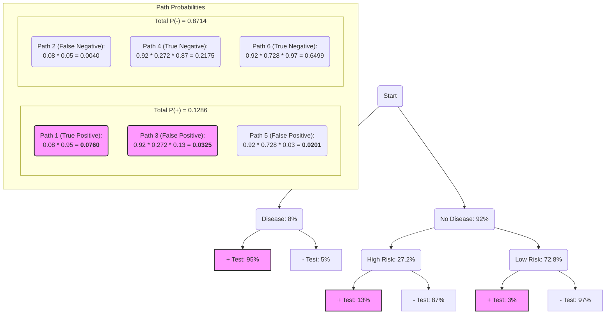

```mermaid
graph TD
    A(Start) --> B(Disease: 8%);
    A --> C(No Disease: 92%);

    B --> D[+ Test: 95%];
    B --> E[- Test: 5%];

    C --> F(High Risk: 27.2%);
    C --> G(Low Risk: 72.8%);

    F --> H[+ Test: 13%];
    F --> I[- Test: 87%];

    G --> J[+ Test: 3%];
    G --> K[- Test: 97%];

    subgraph "Path Probabilities"
        subgraph "Total P(+) = 0.1286"
            P1("Path 1 (True Positive):<br>0.08 * 0.95 = <b>0.0760</b>");
            P3("Path 3 (False Positive):<br>0.92 * 0.272 * 0.13 = <b>0.0325</b>");
            P5("Path 5 (False Positive):<br>0.92 * 0.728 * 0.03 = <b>0.0201</b>");
        end
        subgraph "Total P(-) = 0.8714"
            P2("Path 2 (False Negative):<br>0.08 * 0.05 = 0.0040");
            P4("Path 4 (True Negative):<br>0.92 * 0.272 * 0.87 = 0.2175");
            P6("Path 6 (True Negative):<br>0.92 * 0.728 * 0.97 = 0.6499");
        end
    end

    style D fill:#f9f,stroke:#333,stroke-width:2px
    style H fill:#f9f,stroke:#333,stroke-width:2px
    style J fill:#f9f,stroke:#333,stroke-width:2px
    style P1 fill:#f9f,stroke:#333,stroke-width:2px
    style P3 fill:#f9f,stroke:#333,stroke-width:2px
```
